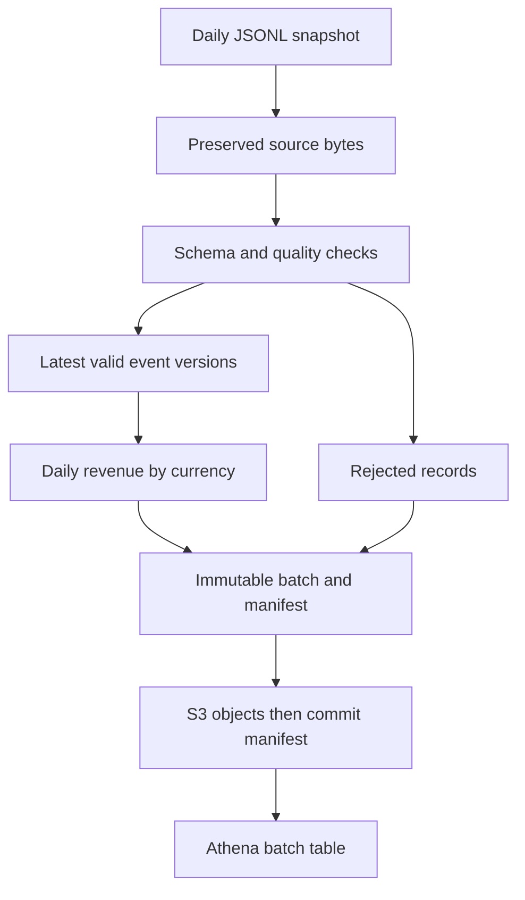

# Data Pipeline Platform

[](https://github.com/rafaelvmedeiros2025/data-pipeline-platform/actions/workflows/ci.yml)

A reproducible daily order-event pipeline with **Python, PySpark, Airflow, Parquet, S3 and Athena**. It answers a concrete reliability question: how can an interrupted or repeated ingestion avoid exposing incomplete analytics?

## Implemented behavior

- Explicit schema; UTC timestamps; money stored as integer cents, grouped separately by currency.
- Bronze: preserve the exact input bytes. Silver: validate and keep the latest event version. Gold: daily event counts and revenue.
- Quarantine malformed JSON, invalid identifiers/amounts/currencies/timestamps and events outside the requested date.
- Fail publication when rejected records exceed the configured ratio (default 25%).
- Collapse exact duplicates; reject conflicting payloads with the same event ID and update timestamp.
- Content-addressed immutable batches, local writer lock and staging-to-batch rename.
- S3 upload writes an object inventory and commit manifest last. Failed uploads do not publish a manifest.
- Daily Airflow DAG with bounded retries, one active run and optional S3 publication.
- Nine tests run real Spark transformations and Parquet reads; S3 protocol tests use an in-memory test double.



## Run locally

Python 3.12 and Java 17 are required. The pinned Spark version is 4.0.2.

```bash
python -m venv .venv
. .venv/bin/activate
pip install -r requirements.txt
SPARK_LOCAL_IP=127.0.0.1 python -m pytest -q
python -m pipeline.run --source samples/2026-01-01.jsonl --lake lake --date 2026-01-01
```

The sample has four input rows: two accepted events, one duplicate and one rejected negative amount. Gold revenue is **3500 USD cents**. Repeating the command returns the same manifest and does not rewrite the batch.

```text
lake/batches/<batch_id>/
  bronze.jsonl
  silver/event_date=2026-01-01/*.parquet
  gold/event_date=2026-01-01/*.parquet
  quarantine/*.parquet
  manifest.json
```

```bash
docker compose run --build --rm pipeline
docker compose --profile airflow up --build airflow
```

Airflow standalone is a development environment at http://localhost:8082. Its generated login details appear in container logs. The sample is dated 2026-01-01: trigger `orders_daily` with logical date 2026-01-01, or supply a JSONL file named for another logical date. Scheduled runs with no input fail explicitly. Pipeline volume retains batch output; standalone metadata is disposable.

## AWS integration

The CLI uses the normal boto3 credential chain; no credentials are committed. Provide an existing bucket and a role/profile with `s3:PutObject` scoped to the chosen prefix:

```bash
AWS_PROFILE=your-profile python -m pipeline.publish \
  --batch lake/batches/<batch_id> --bucket your-bucket
```

Only configure `PIPELINE_S3_BUCKET` in the Airflow container when upload is intended; configure its AWS identity separately. Default execution stays local. AWS services are not provisioned or contacted by tests.

Use `athena/gold.sql` after checking the S3 manifest. Replace the bucket, batch ID and partition date. Each table targets **one committed batch**. A corrected full snapshot creates another batch; do not query all batch roots together, or events will be counted twice. Athena/Glue setup and actual AWS execution remain environment-specific.

## Design boundaries

Each input is a complete snapshot of events for one UTC event date. Deduplication operates within that snapshot, not across arbitrary incremental files. The event count is not an order count. Version ordering uses `updated_at`; a late correction may have an update date after its event date.

The local rename must remain on the same filesystem. A process crash can leave `.writer.lock`; confirm no writer is running before removing it. This is a fail-closed local lock, not a distributed lease. S3 readers must wait for the manifest; Athena registration is a separate manual step. S3 does not offer directory transactions. Concurrent upload attempts must refer to the same immutable local batch; distributed job coordination is not implemented.

The demo reads one source file into driver memory to hash and preserve identical bytes. Large production ingestion should use immutable object versions and a source inventory. Spark runs locally with two threads; there are no cluster-scale performance claims. Currency conversion, CDC, distributed catalog transactions, schema evolution and retention policies are future work.

See [architecture and recovery](docs/architecture.md). Code and documentation are in English.
